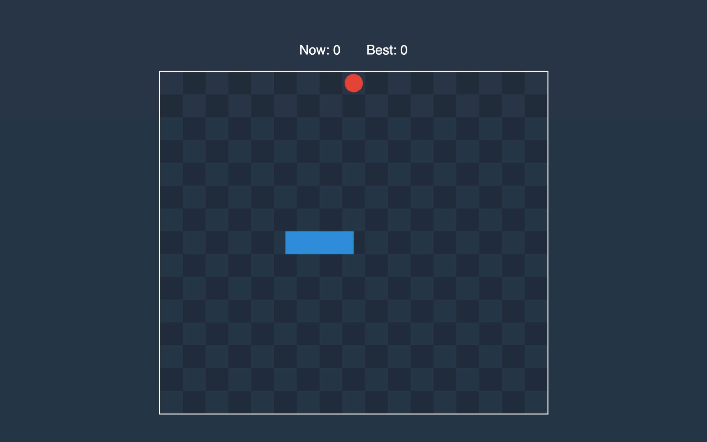

# Recriando o jogo da cobrinha com JavaScript

 Este repositório faz parte de um projeto para a <u>Digital Innovation One</u> (DIO), lecionado pela *Front-End Developer* Gabriela Pinheiro.  O desafio consta a recriação do famoso jogo da cobrinha (snake game) e foi utilizado a tecnologia **JavaScript**, juntamente com **HTML** e **CSS**  no software Visual Studio Code.

> Status do projeto:  Em Andamento :pencil:

